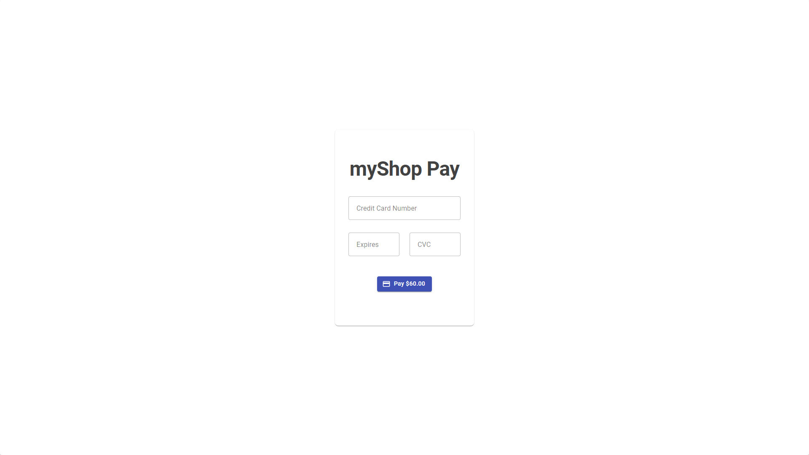

<div align="center"> 
  <h1>myShop Pay - Mock Payment Gateway</h1>
</div>
<br />
<br />

## Table of Contents
1. **[About The Project](#about-the-project)**
    - **[Built with](#built-with)**
2. **[Screenshots](#screenshots)**
3. **[Related Projects](#related-projects)**
4. **[Getting Started](#getting-started)**
5. **[License](#license)**

## About The Project
The project is mock payment gateway, created for **myShop** project.
### Built with
* .NET 8
* ASP.NET Core Blazor
* MudBlazor - Blazor Component Library
* ASP.NET Core Web API
* Entity Framework Core (MS SQL)

## Screenshots
<div align="center">
  
  <p><strong>Payment</strong></p>
  <br />
  <br />
  
  <p><strong>Payment Mobile</strong></p>
  <br />
  <br />
  
  <p><strong>Payment Accepted</strong></p>
</div>

## Related Projects
* **[myShop API](https://github.com/marcin-niewczas/MyShop-API)**
* **[myShop Angular Client](https://github.com/marcin-niewczas/MyShop-Angular-Client)**

## Getting Started
> [!IMPORTANT]
> For fully functionality, the **myShop Pay** project must have **[related projects](#related-projects)** running.
> 
> Full instruction for starting **myShop** projects is **[here](https://github.com/marcin-niewczas/MyShop-API#launch-myshop-projects)**.
1. Clone repository
   ```sh
   git clone https://github.com/marcin-niewczas/MyShop-Pay.git
   ```
2. Database
   - Windows
     - Nothing to do, but if you wanna run database via **Docker** go to `Mac OS/Linux` step
   - Mac OS/Linux
     - Go to `./MyShopPay/appsettings.json` and comment `WindowsConnectionString`, then uncomment `DockerConnectionString`
     - Run **Docker App**
     - In root directory of repository run
       ```sh
       cd ../../
       docker-compose up -d
       ```
3. In root directory of repository run
   ```sh
   dotnet run --project ./MyShopPay/MyShopPay.csproj --launch-profile https
   ```
## License
Distributed under the **MIT License**. See **[LICENSE](./LICENSE)** for more information.
